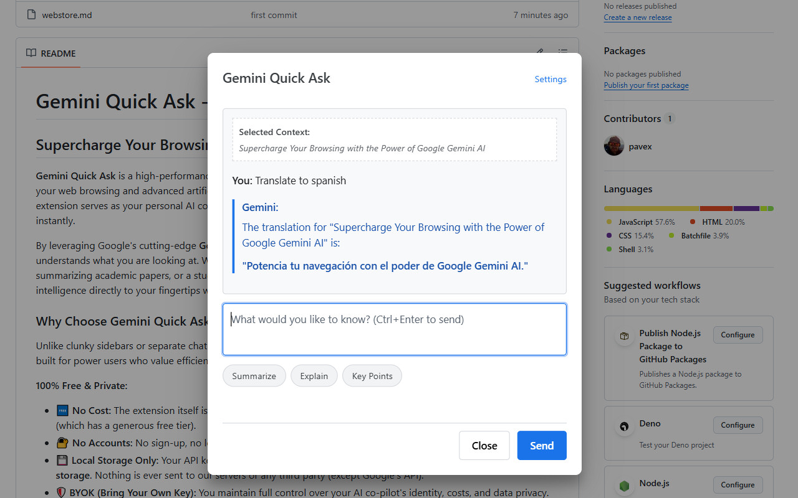

# Gemini Quick Ask - Google Chrome extension

## Supercharge Your Browsing with the Power of Google Gemini AI

**Gemini Quick Ask** is a high-performance, lightweight Google Chrome extension designed to bridge the gap between your web browsing and advanced artificial intelligence. In an era where information density is at an all-time high, this extension serves as your personal AI co-pilot, enabling you to distill, explain, and interact with any content on the web instantly.

By leveraging Google's cutting-edge **Gemini API**, this extension provides a seamless, context-aware interface that understands what you are looking at. Whether you are a developer deciphering complex documentation, a researcher summarizing academic papers, or a student learning a new language, Gemini Quick Ask brings world-class AI intelligence directly to your fingertips without ever leaving your current tab.

### Why Choose Gemini Quick Ask?

  

Unlike clunky sidebars or separate chat windows, Gemini Quick Ask focuses on speed and surgical precision. It was built for power users who value efficiency and privacy.

**100% Free & Private:**
- 🆓 **No Cost:** The extension itself is completely free. You only pay for what you use via your own Gemini API key (which has a generous free tier).
- 🔐 **No Accounts:** No sign-up, no login, and no tracking. Just install and start asking.
- 💾 **Local Storage Only:** Your API key, custom prompts, and settings are stored **only in your browser's local storage**. Nothing is ever sent to our servers or any third party (except Google's API).
- 🛡️ **BYOK (Bring Your Own Key):** You maintain full control over your AI co-pilot's identity, costs, and data privacy.

---

## 🚀 Key Features

- **Intuitive Contextual Awareness:** Automatically captures selected text or parses the entire page content to provide the AI with perfect context for your questions.
- **Lightning-Fast Access:** Trigger the AI interface via a customizable keyboard shortcut (`Ctrl+Shift+G`), the right-click context menu, or by simply clicking the extension icon.
- **Rich Markdown Rendering:** AI responses are beautifully formatted using [marked](https://marked.js.org/), supporting nested lists, bold highlights, and syntax-highlighted code blocks for maximum readability.
- **Customizable Prompt Templates:** Save your most frequent instructions (e.g., "Summarize," "Refactor Code," "Translate to Czech") as one-click buttons to eliminate repetitive typing.
- **Global System Instructions:** Define a persistent "base personality" or language preference for your AI co-pilot that applies to every single request.
- **Privacy-Centric Design:** Your Gemini API Key is stored locally using `chrome.storage.local`. Your data never touches our servers—it goes directly from your browser to Google.
- **Dynamic UI Scaling:** Adjust the interface size to match your screen resolution and comfort level with the built-in scaling feature.

## 🛠 Installation

### For Users (Manual Installation)
1. Download the latest release package: `ask-gemini-vX.X.X.zip`.
2. Extract the ZIP file to a permanent folder on your computer.
3. Open Google Chrome and go to `chrome://extensions/`.
4. Enable **Developer mode** (toggle in the top-right corner).
5. Click the **Load unpacked** button and select the `dist` folder from your extracted files.

### For Developers
1. Clone this repository: `git clone https://github.com/your-username/ask-gemini-chrome-extension.git`
2. Install the necessary development tools: `npm install`
3. Build the project: `npm run build`
4. Load the generated `dist` folder into Chrome as an unpacked extension.

## ⚙️ Configuration

1. **Get your API Key:** Visit [Google AI Studio](https://aistudio.google.com/app/apikey) to generate your free Gemini API key.
2. **Setup:** Open the extension and click the **Settings** link.
3. **Customize:** Paste your key, select your preferred model (e.g., `gemini-1.5-flash`), and add your custom prompts.

## ⌨️ Shortcuts
The default shortcut is `Ctrl+Shift+G`. You can customize this at any time by visiting `chrome://extensions/shortcuts`.

## 📦 Tech Stack
- **Language:** Modern JavaScript (ES6+)
- **Bundler:** [esbuild](https://esbuild.github.io/) for ultra-fast builds
- **Parser:** [marked](https://marked.js.org/) for Markdown support
- **Manifest:** Chrome Extension Manifest V3 (Latest Standard)

---
*Disclaimer: This extension is not officially affiliated with Google. It is a third-party tool that utilizes the Google Gemini API.*
